通过特定的统计方法(数学方法)将数据转换成算法要求的数据
## 数值类型 标准缩放
- 归一化 
- 标准化
- 缺失化

## 类别型数据
-  one-hot编码
## 时间类型 
-  时间切片

# sklearn特征处理API

 * sklearn.preprocessing
## 归一化
**特点**：通过对原始数据进行变化把<font color="red">数据映射到[0-1]之间</font>
**目的**：使得某一个特征不会影响整个结果
**缺点**：当数据有异常时，最大值和最小值对数据预测的准确的影响较大 ，只适合传统精确小数据场景


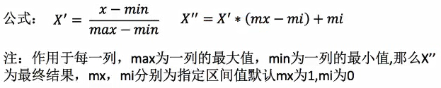

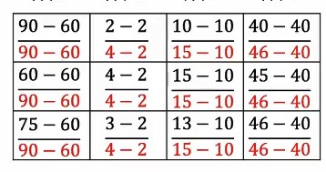


### API

**sklearn归一化API**：sklearn.preprocessing.MinMaxScaler

#### MinMaxScalar(feature_range(0,1),...)
- 每个特征缩放到给定范围（默认[0-1]）

####  MinMaxScaler.fit_transform(X)
- X：numpy array格式的数据[n_samples,n_features]
- 返回值:转换后的形状相同的array


```
from sklearn.preprocessing import MinMaxScaler
 mm = MinMaxScaler(feature_range=(3,4))
data = [
    [90, 2, 40, 30],
    [60, 4, 30, 100],
    [75, 3, 30, 50]
]

result = mm.fit_transform(data)
print(result)
```
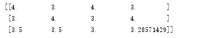

## 标准化
**特点**：通过对原始数据进行变换把数据变换到<font color="red">均值为0，方差为1</font>范围内
**优点**：在数据比较多的时候比较稳定
如果出现异常点，由于具有一定数据量，少量的异常点对于平均值的影响并不大，从而方差变化较小
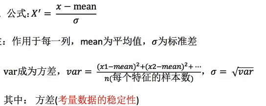

### API 
标准化 API：sklearn.preprocessing.StandardScaler

StandardScaler(...)

#### StandardScaler.fit_transform(X)
- x:numpy array格式的数据[n_samples,n_features]
- 返回值:转换后的形状相同的array

#### StandardScaler.mean_
- 原始数据中每列特征的平均值

#### StandardScaler.std_
- 原始数据每列特征的方差
 
```
from sklearn.preprocessing import  StandardScaler

ss=StandardScaler()
data=[
    [1,4,9],
    [4,8,2],
    [2,6,7]
]
result=ss.fit_transform(data)
print(result)
print(ss.mean_)
print(ss.scale_)
```
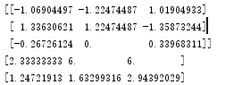

## 缺失值处理

### 删除

删除会导致数据减少，不建议删除操作

### 插补

API：sklearn.preprocessing.Imputer(中值填补，中位数 填补)

Imputer(missing_values="NaN",strategy="mean",axis=0)

#### Imputer.fit_transform(X)
- x:numpy array格式数据[n_samples,n_features]
- 返回值：转换后的形状相同的array

```
from sklearn.preprocessing import Imputer
im=Imputer(missing_values="NaN",strategy="mean",axis=0)
data=[
    [1,2,3,2,5],
    [2,3,4,np.nan,6],
    [3,4,5,6,7]
]
result=im.fit_transform(data)
print(result)
```
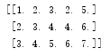

## 数据降维
冗余：部分特征的相关度，容易小号计算性能
噪声：部分特征对预测结果有影响

### 特征选择
    主要方法：
    Filter（过滤式）：varlanceThreshold
    Embedded（嵌入式）：正则化，决策树
    Wrapper（包裹式）

    

#### Filter
类库：sklearn.feature_selection.VarianceThreshold

##### VarianceThreshold(threshold=0.0)
删除所有低方差特征

##### Vaiance.fit_transform(X)

- X:numpy array格式的数据[n_samples,n_features]

- 返回值：训练集差异低于threshold的特征将被删除

- 默认值式保留所有非零方差特征，即删除所有样本中具有相同值的特征

```
    from sklearn.feature_selection import VarianceThreshold
    selector = VarianceThreshold()
    X = [
        [0, 2, 0, 3],
        [0, 1, 4, 3], 
        [0, 1, 1, 3]
    ]
    data=selector.fit_transform(X)
    print(data)
```
[[2 0]
 [1 4]
 [1 1]]
 

### 主成分分析
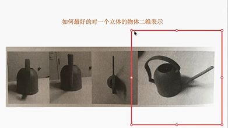
<font color="red">当特征数量达到上百的时候，考虑数据的简化</font>

<font color="red">PCA本质</font>：一种分析，简化数据集的技术
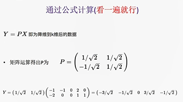
<font color="red">目的</font>：数据维数压缩，尽可能降低原数据的维数，损失少量信息
<font color="red">作用</font>：可以削减回归分析或者聚类分析中特征的数量

类库：sklearn.decomposition.PCA

#### PCA API
##### PCA(n_components=None)
- n_compoents 
 - 小数：的范围在0-1之间一般情况下 保留数据的90%-95%
 - 整数：减少到的特征数量，一般不指定证书
- 将数据分解为低维数空间
##### PCA.fit_transform(X)
- X:numpy array格式的数据[n_samples,n_features]
- 返回值：转换后指定维度的array


```
    from sklearn.decomposition import PCA
    X=[
        [2, 8,4,5],
        [6,3,0,8],
        [3, 4,9,1]
    ]
    p=PCA(n_components=0.9)
    data=p.fit_transform(X)
    print(data)
```
<font color=red>这些数据保留了原始数据90%的特征</font>
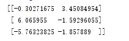


# 数据类型
## 离散性数据
由记录不同类别个体的数目所得到的数据,又称计数类型,所有这些数据全部都是整数，而且不能再细分，也不能进一步提高他们的精度


## 连续性数据
变量可以在某个返回内取任一数，即变量的取值可以是连续的，如：长度，时间，质量值等，这类证书通常是非整数，含又小数部分。

注意：离散型是区间内不可分，连续型是区间内可分

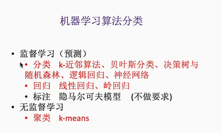

## 监督学习
- 有目标值的预测
## 无监督学习
- 没有目标值

分类：目标值离散型
回归：目标值连续型 预测数据


# 机器学习开发流程
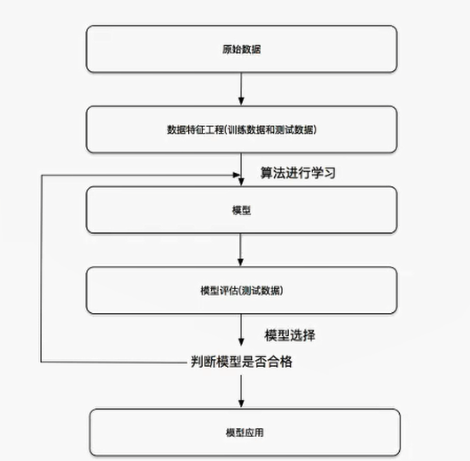

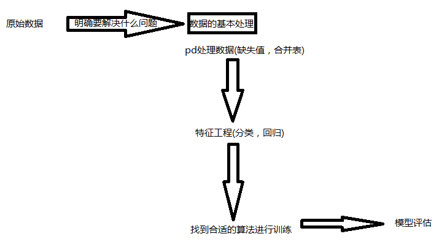</textarea>
			<!-- markdown -->
			<pre class="content-markdown"># 特征处理

通过特定的统计方法(数学方法)将数据转换成算法要求的数据
## 数值类型 标准缩放
- 归一化 
- 标准化
- 缺失化

## 类别型数据
-  one-hot编码
## 时间类型 
-  时间切片

# sklearn特征处理API

 * sklearn.preprocessing
## 归一化
**特点**：通过对原始数据进行变化把<font color="red">数据映射到[0-1]之间</font>
**目的**：使得某一个特征不会影响整个结果
**缺点**：当数据有异常时，最大值和最小值对数据预测的准确的影响较大 ，只适合传统精确小数据场景


### API

**sklearn归一化API**：sklearn.preprocessing.MinMaxScaler

#### MinMaxScalar(feature_range(0,1),...)
- 每个特征缩放到给定范围（默认[0-1]）

####  MinMaxScaler.fit_transform(X)
- X：numpy array格式的数据[n_samples,n_features]
- 返回值:转换后的形状相同的array


```
from sklearn.preprocessing import MinMaxScaler
 mm = MinMaxScaler(feature_range=(3,4))
data = [
    [90, 2, 40, 30],
    [60, 4, 30, 100],
    [75, 3, 30, 50]
]

result = mm.fit_transform(data)
print(result)
```


## 标准化
**特点**：通过对原始数据进行变换把数据变换到<font color="red">均值为0，方差为1</font>范围内
**优点**：在数据比较多的时候比较稳定
如果出现异常点，由于具有一定数据量，少量的异常点对于平均值的影响并不大，从而方差变化较小


### API 
标准化 API：sklearn.preprocessing.StandardScaler

StandardScaler(...)

#### StandardScaler.fit_transform(X)
- x:numpy array格式的数据[n_samples,n_features]
- 返回值:转换后的形状相同的array

#### StandardScaler.mean_
- 原始数据中每列特征的平均值

#### StandardScaler.std_
- 原始数据每列特征的方差
 
```
from sklearn.preprocessing import  StandardScaler

ss=StandardScaler()
data=[
    [1,4,9],
    [4,8,2],
    [2,6,7]
]
result=ss.fit_transform(data)
print(result)
print(ss.mean_)
print(ss.scale_)
```


## 缺失值处理

### 删除

删除会导致数据减少，不建议删除操作

### 插补

API：sklearn.preprocessing.Imputer(中值填补，中位数 填补)

Imputer(missing_values="NaN",strategy="mean",axis=0)

#### Imputer.fit_transform(X)
- x:numpy array格式数据[n_samples,n_features]
- 返回值：转换后的形状相同的array

```
from sklearn.preprocessing import Imputer
im=Imputer(missing_values="NaN",strategy="mean",axis=0)
data=[
    [1,2,3,2,5],
    [2,3,4,np.nan,6],
    [3,4,5,6,7]
]
result=im.fit_transform(data)
print(result)
```


## 数据降维
冗余：部分特征的相关度，容易小号计算性能
噪声：部分特征对预测结果有影响

### 特征选择
    主要方法：
    Filter（过滤式）：varlanceThreshold
    Embedded（嵌入式）：正则化，决策树
    Wrapper（包裹式）

    

#### Filter
类库：sklearn.feature_selection.VarianceThreshold

##### VarianceThreshold(threshold=0.0)
删除所有低方差特征

##### Vaiance.fit_transform(X)

- X:numpy array格式的数据[n_samples,n_features]

- 返回值：训练集差异低于threshold的特征将被删除

- 默认值式保留所有非零方差特征，即删除所有样本中具有相同值的特征

```
    from sklearn.feature_selection import VarianceThreshold
    selector = VarianceThreshold()
    X = [
        [0, 2, 0, 3],
        [0, 1, 4, 3], 
        [0, 1, 1, 3]
    ]
    data=selector.fit_transform(X)
    print(data)
```
[[2 0]
 [1 4]
 [1 1]]
 

### 主成分分析

<font color="red">当特征数量达到上百的时候，考虑数据的简化</font>

<font color="red">PCA本质</font>：一种分析，简化数据集的技术

<font color="red">目的</font>：数据维数压缩，尽可能降低原数据的维数，损失少量信息
<font color="red">作用</font>：可以削减回归分析或者聚类分析中特征的数量

类库：sklearn.decomposition.PCA

#### PCA API
##### PCA(n_components=None)
- n_compoents 
 - 小数：的范围在0-1之间一般情况下 保留数据的90%-95%
 - 整数：减少到的特征数量，一般不指定证书
- 将数据分解为低维数空间
##### PCA.fit_transform(X)
- X:numpy array格式的数据[n_samples,n_features]
- 返回值：转换后指定维度的array


```
    from sklearn.decomposition import PCA
    X=[
        [2, 8,4,5],
        [6,3,0,8],
        [3, 4,9,1]
    ]
    p=PCA(n_components=0.9)
    data=p.fit_transform(X)
    print(data)
```
<font color=red>这些数据保留了原始数据90%的特征</font>


# 数据类型
## 离散性数据
由记录不同类别个体的数目所得到的数据,又称计数类型,所有这些数据全部都是整数，而且不能再细分，也不能进一步提高他们的精度


## 连续性数据
变量可以在某个返回内取任一数，即变量的取值可以是连续的，如：长度，时间，质量值等，这类证书通常是非整数，含又小数部分。

注意：离散型是区间内不可分，连续型是区间内可分


## 监督学习
- 有目标值的预测
## 无监督学习
- 没有目标值

分类：目标值离散型
回归：目标值连续型 预测数据


# 机器学习开发流程


	